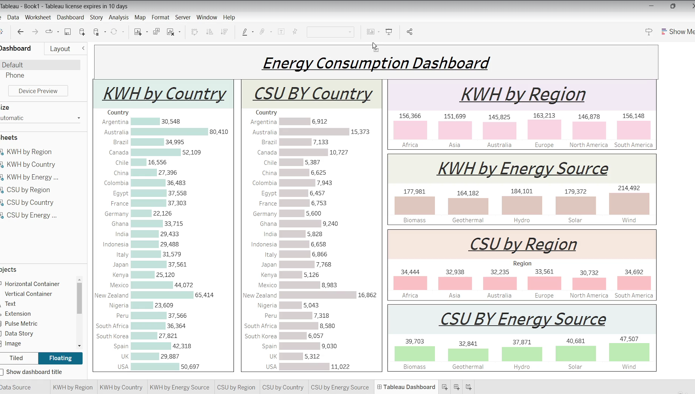

# Energy Consumption Analytics Dashboard  

## Problem Statement  
Energy efficiency is a global priority for sustainable development. Policymakers, businesses, and households need data-driven insights to identify consumption patterns and cost-saving opportunities. 
This project demonstrates a complete cloud-based analytics pipeline using **AWS S3, Snowflake, and Tableau** to analyze household energy consumption (kWh) and cost savings (USD). The final output is an interactive Tableau dashboard for decision-making.  

## Objectives  
- Build an **end-to-end pipeline** from ingestion → transformation → visualization → publishing.  
- Analyze **monthly energy usage and savings** across:  
  - Region  
  - Country  
  - Energy Source  
- Present clear, actionable insights in an interactive dashboard hosted on Tableau Cloud.  

## Tools & Technologies  
- **AWS S3** → Raw data storage  
- **Snowflake** → Data warehouse for profiling & transformation  
- **SQL** → Data cleaning and business rule application  
- **Tableau Desktop** → Dashboard design  
- **Tableau Cloud** → Publishing & collaboration  

## Steps Followed  

### 1. Data Ingestion (AWS → Snowflake)  
- Stored dataset in AWS S3  
- Connected S3 with Snowflake using IAM role & integration object  
- Loaded data into Snowflake staging tables with `COPY INTO`  

### 2. Data Profiling (Snowflake)  
- Checked distributions, nulls, and ranges  
- Profiled energy usage by income level, subsidy received, region, and energy source  

### 3. Data Transformation (Snowflake)  
- Applied business rules:  
  - Low income: +10% usage, –10% savings  
  - Middle income: +20% usage, –20% savings  
  - High income: +30% usage, –30% savings  
- Preserved raw dataset and built a transformed replica table  

### 4. Visualization (Tableau Desktop)  
- Created **6 interactive charts**:  
  - Usage (kWh) by Region, Country, Energy Source  
  - Cost Savings (USD) by Region, Country, Energy Source  
- Applied best practices: clear titles, color coding, alignment, and data labels  

### 5. Publishing (Tableau Cloud)  
- Published dashboard with descriptions and tags  
- Shared for collaboration with role-based permissions
  
## Insights from Dashboard  

The Energy Consumption Dashboard reveals important patterns:  

### 1. Consumption by Country  
- **Australia (80,410 kWh)** and **New zealand (65,4141 kWh)** are among the highest energy consumers.  
- **Chile, Germany, and Nigeria** show lower usage, indicating possible efficiency or resource limitations.  

### 2. Cost Savings by Country  
- Developed nations like **Australia, New Zealand, and USA** show the largest cost savings, due to higher adoption of efficient energy sources.  
- Lower savings in countries like **Chile, UK, and Nigeria**, highlighting potential areas for subsidy programs or renewable adoption.  

### 3. Regional Comparison  
- **Europe (163,213 kWh)** leads in energy consumption, followed by Africa and South America.  
- Cost savings across regions are fairly balanced but show slight advantages in **Europe and South America**, suggesting efficient usage patterns.  

### 4. Energy Source Analysis  
- **Wind (214,492 kWh)** and **Hydro (184,101 kWh)** are the most consumed energy sources.  
- **Solar (179,372 kWh)** is gaining traction but lags slightly behind hydro/wind.  
- **Cost Savings by Energy Source** highlight **Solar (40,681 USD)** and **Wind (47,507 USD)** as high-efficiency contributors, validating investments in renewables.  

## Tableau Dashboard

## Future Enhancements  
- Add year-wise filters and subsidy segmentation  
- Automate pipeline with **real-time streaming from S3 → Snowflake**  
- Add **predictive analytics** (e.g., forecasting regional energy consumption trends)  
- Build **KPI-driven executive dashboards** for quick decision-making  
